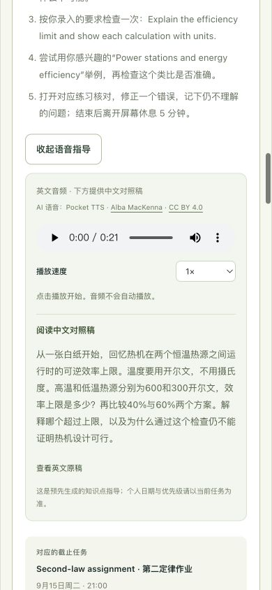

# StudyGPS 产品审查与验收 / Product audit

审查日期：2026-09-13。保留现有设计与独立测评引擎，完成推荐、重新规划、语音、双语和展示流程的改进。八项最终启发式评分均达到8/10以上；这是本轮代码及浏览器验收结论，不是用户研究、学习效果实验、生产认证或比赛评分。

起始参考为 `3c93a0f`。起始分数结合旧版本代码与本轮局部截图，不能代替修改前的完整可用性研究。最终检查覆盖四个页面、学生与教师流程，桌面1280/1440px和窄屏360/390px。截图均在本轮实际打开并查看后保存。

## 目标用户与完整叙事

核心用户是有课程、作业与考试压力的大学生，尤其是资料已有不少、但难以决定下一步和安排有限时间的人。老师是支持自己班级学生的协作者。当前演示课程是热力学；这不代表系统已经覆盖所有专业或自动理解任意大学课程。

**What to study → When to study → How to study → Continuous rerouting**：从已记录的掌握程度出发，结合学生填写的目标、截止日期、要求和可用时间，生成带方法的近期安排；完成学习或更新输入后重新规划。

| 叙事环节 | 页面如何表达 | 可展示的证据 |
| --- | --- | --- |
| Problem / 问题 | 知道什么时间要交，不等于知道今天先学什么。 | 首页主文案与问题段落。 |
| Existing-tool gap / 现有信息的空白 | 笔记、日期与清单提供信息，学生仍需把这些信息与自己的掌握程度连接起来。没有对具体竞品作未经研究的比较。 | 首页 `problem-frame`；不宣称其他产品均不能规划。 |
| StudyGPS / 产品答案 | 把当前位置、目的地、可用时间连接成下一条路线。 | 首页四步路线条与公开导航入口。 |
| How / 如何运行 | 薄弱程度、课程权重和紧迫程度影响优先级，再按学习时段安排主动回忆、练习和复习。 | 首页公式模块、公开导航实验、任务原因与步骤。 |
| Evidence / 依据 | 同分不同短板案例、可查的计算依据、学习科学原文、明确的产品默认规则。 | Alex/Sarah合成案例；18与6公式示例；Berkeley及间隔练习来源。 |
| Impact / 希望改变什么 | 让学生更容易开始一项具体任务，让老师更容易给出有针对性的建议。 | 可演示“推荐→完成→新测评→重排”的操作闭环；没有已证实的提分、留存或节时数据。 |
| CTA / 下一步 | 先体验公开演示；需要保存个人记录时再进入学习空间；价格方案单独查看。 | 首页hero、导航与页脚的演示、学习空间及Pricing链接。 |

## 八项初始评分、发现与改进

分数采用10分制，0.5分为主观粒度；不计算一个看似精确的综合成绩。每个低于8分的起始问题都已落实改进，末列为最终验收结果。

| 用户指定维度 | 初始评分 | 初始发现与证据 | 本轮已做的实际改进 | 最终评分与证据 |
| --- | ---: | --- | --- | --- |
| 首页第一印象 | 8.0 | 现有地形主图、深蓝/象牙白/浅绿配色和大标题已经形成完整视觉识别；起始标题更偏品牌情绪，具体产品定位出现较晚。 | 保留主图与布局；首屏明确what/when/how；增加简短问题段、路线四步和明显的Pricing入口。 | **8.5**：首屏保留地形主图与明确CTA；具体说明大学生、what/when/how及持续重新规划。见截图1。 |
| 产品价值是否一眼能懂 | 6.5 | 起始文案能解释“分数变计划”，但不完整说明何时学习、怎样学习，以及为何有了清单还需要路线。 | 文案连接当前位置、目标、截止日期、时间习惯、本站成绩/进度/教师反馈；公开实验可改变情况并看到路线回应。 | **9.0**：公开演示直接显示三个答案，并可通过deadline、完成状态和新测评实际改变下一步；没有要求评委先注册。未做真实用户理解测试。 |
| UI/视觉质量 | 8.0 | 起始CSS已有响应式卡片、字体层级、减少动效支持和可见内容回退；可复用的视觉体系应保留。 | 科学模块、优先级公式与价格页延续原色系；价格卡、假设成本计算器和边界说明形成独立层级。 | **8.5**：首页、价格与导航延续原字体、配色和卡片；音频按钮独立样式，滚动目标避开固定顶栏。见截图1–4。 |
| UX与操作流程 | 6.5 | 原公开demo主要围绕成绩、目标和总时间预算；查看持久个人信息需要登录，公开展示难以直接操作截止日期等新情境。 | 新公开导航实验提供测评、第二定律截止日期、合成睡眠、教师反馈及完成模拟；保留原引擎入口。新增加载/错误/重试，音频需主动播放。 | **8.5**：真实登录、完成后保存与重排、老师详情和草稿均通过；断开本地服务后错误/语言切换/恢复重试通过；切换身份清除原账号内容。 |
| Study GPS推荐逻辑 | 6.5 | 原引擎透明计算目标差距×权重÷建议小时数，适合测评与预算；尚未覆盖真实日期的紧迫程度、学习日程和复习依赖。 | 新导航主排序使用Weakness×Impact×Urgency；加入日期/时间、学习方法、完成依赖与滚动重排。首页说明缺失成绩不当零分、紧迫系数是产品规则；旧核心另行保留。 | **9.0**：15×30%×3=13.5把近期第二定律作业置顶；完成后下一步变为熵，老师草稿同步。日期/预算/依赖/缺失值/并发旧请求有回归测试。 |
| 移动端体验 | 7.5 | 起始版本已有手机适配，但默认中文和新模块尚未为英文长文案、表格及更多入口完成本轮验证。此初始分数不是一次完整手机实测结果。 | 有效URL/已存偏好优先，首次默认英文；保留中文选择。新增模块在360px改为适合窄屏的网格或单列；成本表在容器内横向滚动；首页hero和页脚均可访问Pricing。 | **8.5**：窄屏卡片、表单、音频、套餐与公开控制器无页面级横向溢出；新增直接跳到下一学习块，固定顶栏不遮挡目标。实际手机硬件与辅助技术仍需发布前设备测试。 |
| 可信度 | 7.5 | 原代码已经标明合成分数并提示不能预测提分、n8n实际流程未验证；新增科学/健康/价格/语音叙事需要更明确的来源和实现边界。 | 科学资料直接链接且无背书；健康数据明确synthetic且未连接；价格标planned且不接支付；毛利假设与净利润区分；语音标预生成英文及Pocket TTS/声线许可。 | **8.5**：科学来源可查且无背书；合成健康、模拟时钟、预生成英文语音、拟议定价和Clerk开发实例明确说明。没有实证提分/接入完成的越界主张。 |
| Demo/Hackathon展示效果 | 7.0 | 旧demo可展示同分不同路线和预算变化，真实师生记录已有基础；但公开场景未把日期、负荷、完成、声音与商业假设连成一条短故事。 | 增加公开导航实验和三分钟展示顺序；六名合成学生支持老师演示；真实计算与模拟输入分开说明；价格页可现场核算假设。 | **9.0**：完整串行走过公开重排、短睡、完成、音频、成本计算，保留原微练习和n8n交接；三分钟讲稿可直接使用，但未进行计时真人演讲。 |

## 验收证据

本审查者实际完成并查看过：

- 本地1440px英文科学模块和价格页；360px英文/中文科学模块、中文价格首屏、英文成本计算器及英文优先级模块。截图位于仓库外 `../work/science-desktop-en.png`、`science-mobile-en.png`、`science-mobile-zh.png`、`pricing-desktop-en.png`、`pricing-mobile-zh.png`、`pricing-calculator-mobile-en.png`、`home-priority-mobile-en.png`。这些是局部屏幕证据，不覆盖新公开实验及完整门户。
- 上述360px页面的 `document.documentElement.scrollWidth` 与视口宽度相等。成本表的容器内滚动不等于页面横向溢出。
- `tests/home-science.test.js`与`tests/pricing.test.js`合计37项通过；日志为 `../work/pricing-home-tests.tap`。覆盖语言优先级、静态英文与初次渲染一致、公式/来源边界、USD价格、成本计算与80%舍入边界。
- `tests/health-demo.test.js`六项通过；覆盖严格场景、真实数值拒绝、空记录不降负荷、七天日期和每次生成结果相互独立。这不是健康效果验证。
- 已读 `api/navigation-demo.js`、`web/navigation-demo.js`、语音播放器代码、音频manifest与 `docs/voice.md`，确认公开实验的实际控件名称及语音来源记录。随后主代理完成了新公开实验、学生和教师流程及真实音频播放；未作人工逐词听审。

## 功能与验证边界

| 范围 | 当前实现 | 展示时不得暗示 |
| --- | --- | --- |
| 公开导航实验 | 使用固定合成学生与受限选项调用实际路线规划器；响应标记 `source: synthetic`、`persisted: false`。以当前悉尼日期的12:00为模拟时钟，并在界面明示。 | 改动了任何真实学生账号、模拟时刻就是用户现在的真实时刻，或这些成绩变化证明产品效果。 |
| 个人14天路线 | 根据录入的学习背景与本站记录计算；已验证真实账号保存、完成重排及教师只读详情。 | 自动导入LMS、日历、真实Apple Health或已执行新的n8n流程。 |
| Apple Health | 仅虚构睡眠/血氧；血氧不决定任务强度。short_sleep是滚动演示选项，每次路线只调整当前日期。 | 已连接设备、作出诊断、测出学习能力，或真实健康信息已向老师开放。 |
| Pricing | USD29.99/44.99/79.99的未来方案；成本为假设，页面没有checkout或订阅扣款。 | PDF额度、多渠道消息、语音教练或成绩模拟器已按付费套餐交付；“Unlimited”意味着无限计算预算；示例毛利等于净利润。 |
| 登录与班级 | Clerk身份验证及班级数据隔离已实现；当前是Clerk开发实例。 | 已完成正式生产身份系统上线，或老师可以任意查看平台所有学生。 |
| Pocket TTS | 四段预生成英文学习提示，中文界面提供中文对照稿，音频由静态文件播放。 | 实时语音教练、录音/口语评判、中文Pocket TTS，或针对私人学习/健康信息实时生成语音。 |
| 学习科学 | Berkeley与间隔练习文献提供方向；学习长度、休息、1/3/7天及紧迫系数是产品规则。 | Berkeley背书或合作、研究规定了这些精确参数，或参数已实证最优。 |

## 三分钟上台流程 / Three-minute walkthrough

只使用公开合成实验即可完成主体演示，不需要评委注册。开场用一句话说明：“这是大学生的学习导航：不只看什么时候要交，更帮助决定学什么、何时学、怎么学，并持续重规划。” / “StudyGPS helps students decide what to learn, when to study and how to practise, then re-routes as their situation changes.”

| 时间 | 真实控件与操作 | 看哪里、讲什么 |
| --- | --- | --- |
| 0:00–0:25 | 打开首页；指出四步路线与Priority公式；点hero中的公开演示入口。 | 当前水平→目标→学习路线→更新。说明算法规则透明，分数未知先检查。 |
| 0:25–0:55 | 在页面顶部公开导航实验保留 `Starting point: Alex · First assessment`；将 `Second-law assignment` 从 `No deadline / feedback` 改为 `Due in 2 days`（`#lab-urgency`值`soon`）。 | 指出what/when/how与第一条任务原因。相同成绩，因为近期第二定律作业而改变顺序。等待“Route updated”后再讲结果。 |
| 0:55–1:20 | 将 `Apple Health simulation` 改为 `Short sleep · fictional 5.2 h`（`#lab-sleep`值`short_sleep`）。 | 明确是虚构数据，并指出12:00模拟时钟；展示今日预算减半、专注上限20分钟与未来安排。血氧不参与调整。 |
| 1:20–1:45 | 勾选 `Simulate completing the first block`。 | 下一项与复习安排更新；这只是公开合成完成模拟，不写账号、不证明掌握。可快速切Alex更新测评展示另一条重新规划路径；切其他选项会重置完成模拟。 |
| 1:45–2:10 | 展开一条任务，点 `Listen to study guide` / `听学习步骤`，再点原生播放器Play；展示文字稿并暂停。 | 预生成Pocket TTS英文提示；中文界面有对照稿。声音提示“回忆→练习→检查”，并非实时AI教练。无音频时用文字稿继续。 |
| 2:10–2:45 | 点 `View planned pricing`；选择Gold成本计算器，将假设直接成本调到USD9。 | 三档均为未来方案；Gold真实结果略低于80%，界面显示`<80.00%`。说明成本是可质疑的假设，毛利不是净利润。 |
| 2:45–3:00 | 回到页面的现有demo或学习空间CTA。 | 收束到可用产品：先体验规则路线，需要保存个人记录再登录。老师班级的六个合成学生作为问答补充，不必塞进三分钟主体。 |

## 最终验证

- `npm test`：306项通过，包含原引擎、API、身份/班级隔离、导航日期/排序/依赖/预算、并发完成、前端状态、音频生命周期及隔离静态构建。
- `npm run build`与`git diff --check`通过；原始n8n bundle校验保持一致。
- 静态与HTTP审计：44个发布文件、173处内部引用/锚点、8种页面语言组合、4个路由别名通过。4段音频哈希、来源哈希、`audio/wav`、HEAD与Range请求通过。发布目录不含env、测试、私有数据或模型权重；已扫描已配置秘密值，无匹配。
- 真实学生流程：已有QA账号通过Clerk登录；保存规划、完成学习块后得到成功反馈；第二定律完成时间和20分钟时长被保存，下一步变为熵；刷新和中文切换后记录仍在。未创建或删除QA账号。
- 真实教师流程：已有QA老师只显示自己班级的学生；搜索无结果空状态、恢复搜索、个人详情与“使用草稿”通过；草稿跟随学生最新的熵任务及其实际日期/25分钟时长。教师没有代替学生完成学习块的控件。旧名单重点与课程完成统计明确标为测评/课程参考。
- 公开路线：正常时先Rankine；两天后deadline变Second law，显示13.5；短睡25→20分钟；完成后显示下一项；固定当天悉尼12:00的模拟时钟可见。此处不写入个人账号。
- 错误恢复：实际停止本地服务后，公开路线显示失败并保留选择；切中文仍显示失败；重启后点重试恢复。同类请求中断、重复点击、晚响应、未保存输入保护有自动化覆盖。
- 音频：在浏览器点击原生Play，时间实际递增（6.6秒时仍在播放）；倍速、暂停/收起与页面变化停止均已检查。修复本地音频长度/Range后第二定律显示21.36秒；手机原生播放器显示0:21，中文对照稿可展开。四段真实Pocket TTS预生成音频约21–24秒，未作人工逐词听审。
- 原流程：原30分钟预算示例正确显示延期/调整；朗肯循环微练习先选40%出现解释，改选39%得到正确反馈；未更改成绩或自动假装掌握。
- 窄屏验收包含英文/中文首页、公开路线、学生任务与规划表单、教师详情、音频和价格页。关键视图无页面级横向溢出，输入与播放控件可用。尚未完成实际手机软键盘、屏幕阅读器、200%文字缩放或跨浏览器设备矩阵，因此不声明全面无障碍认证。

发布记录由最终合并与Vercel检查确认；仅创建部署不算已发布。规范地址为 [StudyGPS](https://studygps-five.vercel.app)、[公开演示](https://studygps-five.vercel.app/demo.html?lang=en)、[价格](https://studygps-five.vercel.app/pricing.html?lang=en)。

## 本轮截图

1. 首页：保留现有地形视觉，明确学习导航与实际入口。

2. 学生任务：中文手机视图包含what、when、duration、review、公式与why/how；目标跳转停在顶栏以下。

3. Pocket TTS：手机原生播放控制、明确英文语音、中文稿与来源署名。

4. 价格：窄屏保留USD、套餐层次和“规划中”标记。

上台前在实际设备按上述顺序走一遍并确认扬声器音量；音频、健康与商业方案按这里标注的边界演示。分数不是比赛名次或成绩改善的保证。
